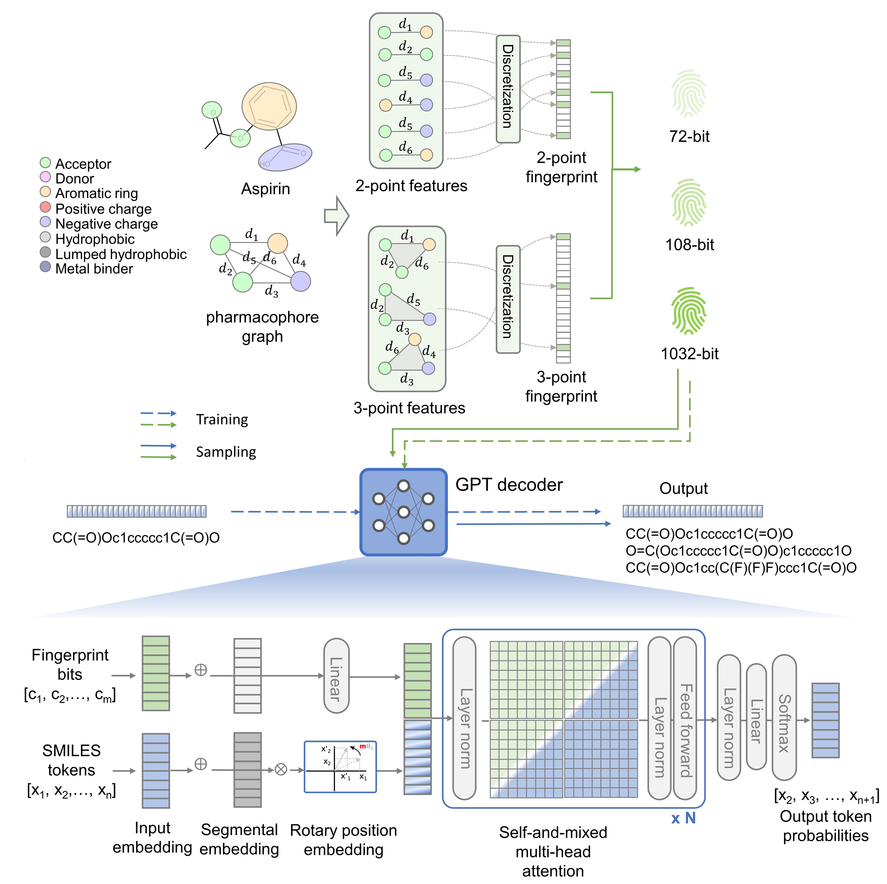

# Transpharmer

TransPharmer is an innovative generative model that integrates ligand-based interpretable pharmacophore fingerprints with generative pre-training transformer (GPT) for de novo molecule generation.
<div align=center>

</div>

The chemical structure of Aspirin is converted into a phar- macophoric topology graph with the shortest topological distance between each feature pair computed. All the two-point and three-point pharmacophoric subgraphs are enumerated, and the topological distances are discretized with specific distance bins. 72- and 108-bit pharmacophore fingerprints are constructed from the two-point pharmacophores with different discretization schemes, while 1032-bit pharmacophore finger- prints are the concatenation of fingerprints of two-point and three-point pharmacophores. The right segment illustrates the architecture of TransPharmer as a pharmacophore fingerprints-driven GPT decoder.

### Requirements

inops==0.6.0
fvcore==0.1.5.post20221221
guacamol==0.5.2
numpy==1.23.4
pandas==1.5.2
rdkit==2022.9.3
torch==1.13.1

## Training
To train your own model from command line
```
python train.py --config configs/train.yaml(your config file)
```

## Benchmarking
To benchmark our model(no-condition version) with guacamol from command line.
```
python benchmark.py --config configs/benchmark.yaml(your config file)
```

## Generate
To generate molecules from command line:
```
python generate.py --config configs/generate_pc.yaml(your config file)
```
We alse provided a toturial based on 2yac ligand for molecule generation see:
[tutorial.ipynb](tutorial.ipynb)

## Configurations
all configurations are provided in corresponding .yaml files:
```
benchmark.yaml
generate_nc.yaml
generate_pc.yaml
train.yaml
```
each file contains model and task-sepcific variables

## Changelog

    230131 init commit


## Contact

    xuyj@iipharma.cn
    1801111477@pku.edu.cn
    zhangjh@iipharma.cn


## License

MIT. See `LICENSE` for more details.